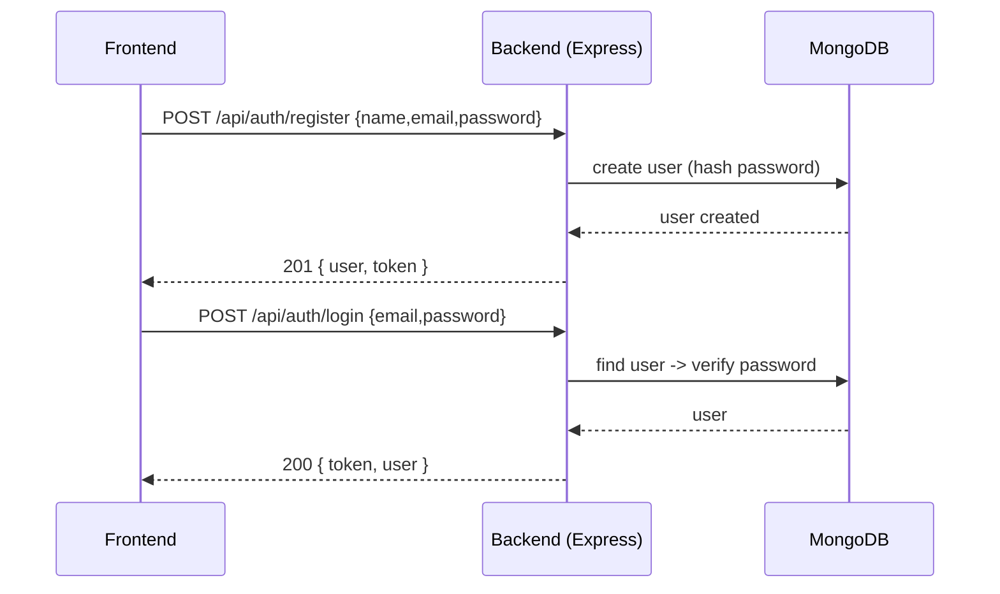
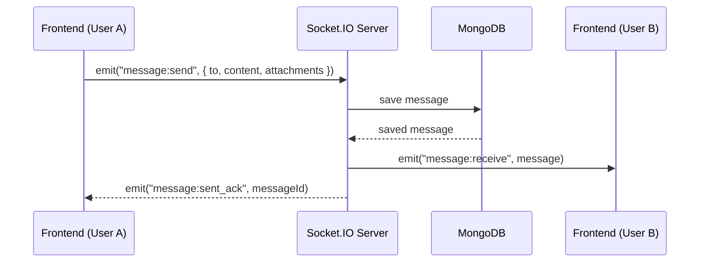

# Technical Document — Full-Stack Real-Time Chat Application

**Project:** fullstack-chat-app  
**Author:** Sankalp  
**Last updated:** September 2, 2025

---

## Table of contents
1. [Project overview](#project-overview)
2. [Architecture & flow diagrams](#architecture--flow-diagrams)
3. [Folder structure](#folder-structure)
4. [Environment variables (.env.example)](#environment-variables-envexample)
5. [Backend — design, models & API endpoints](#backend---design-models--api-endpoints)
6. [Real-time (Socket.IO) events & code snippets](#real-time-socketio-events--code-snippets)
7. [Frontend — structure, state & key components](#frontend---structure-state--key-components)
8. [Cloudinary (media) integration](#cloudinary-media-integration)
9. [Testing & Postman steps](#testing--postman-steps)
10. [Screenshots — which to capture and where to insert](#screenshots---which-to-capture-and-where-to-insert)
11. [How to upload this project & the documentation to GitHub (no `git clone` included)](#how-to-upload-this-project--the-documentation-to-github-no-git-clone-included)
12. [Deployment checklist](#deployment-checklist)
13. [Security & best-practices checklist](#security--best-practices-checklist)
14. [Troubleshooting & common issues](#troubleshooting--common-issues)
15. [Appendix — sample code snippets (quick reference)](#appendix--sample-code-snippets-quick-reference)

---

## Project overview
This document describes a modern real-time chat application built with the MERN stack and Socket.IO for realtime messaging. It covers architecture diagrams, backend design, API endpoints, frontend structure, state management with Zustand, Cloudinary-based media handling, testing steps, and the exact screenshots you should include in the repo for clear clarification.

**Core technologies**
- Frontend: React (Vite), TailwindCSS, DaisyUI
- Backend: Node.js, Express.js
- Database: MongoDB (Atlas or self-hosted)
- Real-time: Socket.IO
- State management: Zustand
- Media storage: Cloudinary
- Authentication: JWT

**Key features**
- JWT auth (register/login)
- Real-time messaging (1:1, read receipts, typing indicators)
- User profiles & avatars
- Message history and persistence
- Responsive UI with dark/light modes

---

## Architecture & flow diagrams
Below are high-level diagrams that describe the runtime architecture and flows.

### 1) High-level architecture

```mermaid
graph LR
  FE[React (Vite) - Browser] -->|HTTP & Socket| BE(Node.js + Express + Socket.IO)
  BE --> DB[MongoDB]
  BE --> Cloud[Cloudinary (media)]
  BE --> OptionalRedis[Redis (optional for scaling/pubsub)]
  FE --> Zustand[Zustand (local state)]
```

> This diagram shows the primary flow: the frontend communicates with the backend via REST for data and via Socket.IO for realtime events. Backend persists messages to MongoDB and uses Cloudinary for file storage. Redis is optional for horizontal scaling (socket session & pub/sub).

### 2) Authentication sequence



### 3) Message delivery (Socket) sequence



---

## Folder structure (recommended)

```
fullstack-chat-app/
├── frontend/
│   ├── public/
│   └── src/
│       ├── components/
│       │   ├── auth/ (Login, Register)
│       │   ├── chat/ (ChatList, ChatWindow, MessageBubble)
│       │   ├── common/ (Header, Avatar, Loader)
│       ├── pages/ (Home, Profile, Settings)
│       ├── context/ (optional React context)
│       ├── hooks/ (useSocket, useAuth)
│       ├── store/ (zustand stores)
│       ├── utils/ (api client, helpers)
│       └── App.jsx
└── backend/
    ├── controllers/
    ├── models/ (User.js, Message.js, Conversation.js)
    ├── routes/ (auth.js, users.js, messages.js)
    ├── middleware/ (auth.js, errorHandler.js)
    └── utils/ (db.js, socket.js)
```

---

## Environment variables (.env.example)
Create `.env` from the example below (do **not** commit real secrets). Always add `.env` to `.gitignore`.

```
# Backend
PORT=5000
MONGODB_URI=mongodb+srv://<username>:<password>@cluster0.mongodb.net/chatdb?retryWrites=true&w=majority
JWT_SECRET=your_jwt_secret_here
JWT_EXPIRES_IN=7d
CLOUDINARY_CLOUD_NAME=your_cloud_name
CLOUDINARY_API_KEY=your_api_key
CLOUDINARY_API_SECRET=your_api_secret
FRONTEND_URL=http://localhost:3000

# Optional (for scaling)
REDIS_URL=redis://:password@host:port
```

On the frontend, you may need `VITE_API_URL` or `VITE_SOCKET_URL` in a `.env` file (Vite expects `VITE_` prefixes):

```
VITE_API_URL=http://localhost:5000/api
VITE_SOCKET_URL=http://localhost:5000
```

---

## Backend — design, models & API endpoints

### Key Mongoose models (summary)

**User**
- _id
- name
- email (unique)
- password (hashed)
- avatarUrl
- status (online/offline)
- lastSeen
- createdAt, updatedAt

**Message**
- _id
- conversationId (or participants array)
- sender (ObjectId -> User)
- content (text)
- attachments [{ url, type }]
- readBy [ObjectId]
- createdAt

**Conversation** (optional, for group support)
- participants [ObjectId]
- lastMessage
- createdAt

---

### Example: Important API endpoints (REST)

> **Note**: Authentication uses `Authorization: Bearer <token>` header

- `POST /api/auth/register` — Register user. Request body: `{ name, email, password }`  
  Response: user data + token

- `POST /api/auth/login` — Login user. Request: `{ email, password }`  
  Response: `{ token, user }`

- `GET /api/users/me` — (Protected) Get current user

- `GET /api/users` — (Protected) Search / list users

- `GET /api/conversations` — (Protected) List conversations for current user

- `GET /api/messages/:conversationId` — (Protected) Fetch messages for a conversation (pagination supported)

- `POST /api/messages` — (Protected) Send a message (if you use REST fallback for sending)

- `POST /api/upload/avatar` — (Protected) Upload avatar (Cloudinary)

Include standard HTTP status codes and consistent error shape: `{ success:false, message: 'Error text', errors: [] }`.

---

## Real-time (Socket.IO) events & code snippets

### Common socket events
**Client -> Server**
- `connect` — built-in
- `authenticate` — send JWT immediately after connect (or use cookie/session)
- `join` — join chat room / set presence
- `message:send` — payload `{ to, content, attachments }`
- `typing` — `{ to, isTyping }`

**Server -> Client**
- `message:receive` — incoming message
- `message:sent_ack` — ack for sender
- `user:online` / `user:offline` — presence updates
- `typing` — typing indicator
- `read:receipt` — read acknowledgement

### Sample server socket setup (simplified)

```js
// backend/utils/socket.js
const { Server } = require('socket.io');
const jwt = require('jsonwebtoken');

function initSocket(server, options = {}) {
  const io = new Server(server, { cors: { origin: process.env.FRONTEND_URL } });

  io.on('connection', socket => {
    console.log('socket connected', socket.id);

    socket.on('authenticate', async ({ token }) => {
      try {
        const payload = jwt.verify(token, process.env.JWT_SECRET);
        socket.userId = payload.id; // attach user id for routing
        // join user to a personal room for direct messages
        socket.join(payload.id);
        // notify friends about online status
        socket.broadcast.emit('user:online', { userId: payload.id });
      } catch (err) {
        socket.emit('unauthorized');
        socket.disconnect(true);
      }
    });

    socket.on('message:send', async (msg) => {
      // validate and save message to DB
      const saved = await saveMessageToDB(msg, socket.userId);
      // emit to recipient's room
      io.to(msg.to).emit('message:receive', saved);
      // ack sender
      socket.emit('message:sent_ack', { id: saved._id });
    });

    socket.on('disconnect', () => {
      console.log('socket disconnect', socket.id);
      // broadcast offline status
    });
  });

  return io;
}

module.exports = initSocket;
```

### Sample client-side connection (use in `useSocket` hook)

```js
import { io } from 'socket.io-client';

export function createSocket(token) {
  const socket = io(import.meta.env.VITE_SOCKET_URL, { autoConnect: false });
  socket.on('connect', () => console.log('connected', socket.id));
  socket.connect();
  socket.emit('authenticate', { token });
  return socket;
}
```

---

## Frontend — structure, state & key components

### Key components
- **Auth**: Login, Register forms with validation
- **ChatList**: Shows conversations and last message
- **ChatWindow**: Shows messages, input box, attachments
- **MessageBubble**: Renders message text/media and timestamp
- **Profile**: Avatar upload and status
- **Settings**: Theme toggle, account options

### Zustand store (skeleton)

```js
import create from 'zustand';

export const useAuthStore = create(set => ({
  user: null,
  token: null,
  setAuth: (user, token) => set({ user, token }),
  logout: () => set({ user: null, token: null })
}));

export const useChatStore = create(set => ({
  conversations: [],
  activeConversation: null,
  messages: {}, // messages[conversationId] = []
  setActive: (id) => set({ activeConversation: id }),
  addMessage: (conversationId, message) => set(state => {
    const msgs = state.messages[conversationId] || [];
    return { messages: { ...state.messages, [conversationId]: [...msgs, message] } }
  })
}));
```

### Recommended UX flows
- After login, immediately open a socket connection and authenticate the socket with the JWT.
- Load recent conversations via REST, then subscribe to realtime events for the active conversation.
- Use optimistic UI updates: show message immediately with a pending state until server ack.

---

## Cloudinary (media) integration

**Best practice**: Upload media from the frontend directly to Cloudinary using an **unsigned** preset or to a signed endpoint generated by the backend (safer). Store returned URLs in message documents; do not store binary data in MongoDB.

**Unsigned example (frontend)**

```js
// Upload file to Cloudinary unsigned from frontend
const form = new FormData();
form.append('file', file);
form.append('upload_preset', 'unsigned_preset_name');
const res = await fetch(`https://api.cloudinary.com/v1_1/${cloudName}/upload`, { method: 'POST', body: form });
const data = await res.json();
// send data.secure_url in message payload
```

**Signed example**: Backend issues a short-lived signature and the frontend uses that to upload.

---

## Testing & Postman steps

1. **Register**: POST `/api/auth/register` — provide name/email/password. Save token from response.
2. **Login**: POST `/api/auth/login` — get token.
3. **Set Authorization**: In Postman, set `Authorization` -> `Bearer <token>` for protected routes.
4. **Test user endpoints**: GET `/api/users/me`.
5. **Test messages**: GET `/api/messages/:conversationId`.
6. **Test socket**: Use a small Node script or socket.io-client playground to connect and emit `authenticate` with your token, then emit `message:send` and observe `message:receive` on the other socket.

> Tip: Save a Postman collection in the repo: `postman/FullstackChat.postman_collection.json`.

---

## Screenshots — which to capture and where to insert

Place all screenshots inside a top-level `screenshots/` folder in the repo. Use descriptive, sequential filenames and insert them into this document (or README) using markdown: ``.

**Recommended screenshot list (order & filename)**

1. `screenshots/01-project-structure.png` — Project root file-tree (IDE explorer).  
   *What to capture*: show `frontend/` and `backend/` folders and main files.

2. `screenshots/02-backend-env.png` — `.env` example (mask sensitive values).  
   *What to capture*: highlight keys (JWT_SECRET, MONGODB_URI) but blur or mask secrets.

3. `screenshots/03-mongodb-atlas.png` — MongoDB Atlas cluster overview & DB name.  
   *What to capture*: cluster status and database > collections list.

4. `screenshots/04-postman-register-login.png` — Postman register & login request + token in response.  
   *What to capture*: request body and response token field.

5. `screenshots/05-socket-server-logs.png` — Terminal showing socket connections and logs.  
   *What to capture*: `socket connected <id>` and `message saved` logs.

6. `screenshots/06-frontend-login.png` — Frontend login screen.

7. `screenshots/07-frontend-chat-window.png` — Chat window with messages (show both sent and received).  
   *What to capture*: typing indicator or read receipt if possible.

8. `screenshots/08-cloudinary-upload.png` — Cloudinary media library showing uploaded avatar or image.

9. `screenshots/09-theme-toggle.png` — Dark/Light theme toggle demonstration.

10. `screenshots/10-deploy-settings.png` — Vercel/Heroku environment variables configuration page (mask secrets).  

11. `screenshots/11-production-screenshot.png` — Production deployed app landing page.

12. `screenshots/12-error-log.png` — Example of common error (optional) to document troubleshooting.

**How to insert screenshots in this document or README**

```md
### Project structure


### Backend .env (masked)

```

**Capture tips**
- Keep screenshots focused (crop unnecessary UI).  
- Blur or redact secrets (DB URIs, API keys) before committing.  
- Use consistent image sizes — 1280×720 or 1600×900 recommended.  
- Provide short captions under each image explaining what it shows.

---

## How to upload this project & the documentation to GitHub (no `git clone` commands included)

You can upload via **GitHub web UI** (recommended for quick uploads) or via the **command line**. This section gives both options — note: **no `git clone`** command is included below per your request.

### A) GitHub Web UI (upload files directly)
1. Go to GitHub → click **+** → **New repository**. Enter repository name, set visibility to **Public**, add a short description. Create repository.
2. In the newly created repo page, click **Add file** → **Upload files**.
3. Drag & drop the entire project folder contents *from your local machine* (do **not** upload your local `.env` file — instead add `.env.example`).
4. Upload the `technical-documentation.md` (this file) or copy/paste its contents into the repository's `README.md` or `docs/TECHNICAL_DOCUMENT.md`.
5. Commit changes with a message like `Add project files and technical documentation`.
6. (Optional) Create a `screenshots/` folder in the repo via the web UI and upload the screenshot files described above.

**Notes**: GitHub web UI has file size limits (100 MB per file). If your project has large assets, consider removing them or using Git LFS.

### B) Command-line push (initialise & push local repo)
> Use this if you're comfortable with git on your machine. Do **not** run `git clone` as requested.

```bash
# from project root
git init
git add .
git commit -m "Initial commit - add fullstack-chat-app and technical documentation"
# create the GitHub repo in web UI first, then copy the repo URL
git remote add origin https://github.com/<your-username>/<your-repo>.git
git branch -M main
git push -u origin main
```

**Where to place the technical document**
- Put the document at the repo root as `TECHNICAL_DOCUMENT.md` or inside a `docs/` folder.
- Add a short link in `README.md` that points to the technical document: `See [TECHNICAL_DOCUMENT.md](./TECHNICAL_DOCUMENT.md)`.

**.gitignore (recommended base)**
```
node_modules/
.env
dist/
build/
.vscode/
.DS_Store
.idea/
```

---

## Deployment checklist
- [ ] Set environment variables in hosting platform (Vercel/Heroku/DigitalOcean).  
- [ ] Verify `MONGODB_URI` points to production DB.  
- [ ] Configure CORS for your frontend origin.  
- [ ] Enable HTTPS (platform usually handles).  
- [ ] Use process manager (PM2) or platform-managed runtime for Node backend.  
- [ ] Configure Cloudinary credentials in production env.  
- [ ] Setup logging (Winston/Elastic/LogDNA) and error monitoring (Sentry).  

---

## Security & best-practices checklist
- Hash passwords with bcrypt (salt >= 10).  
- Store JWT secret safely and rotate periodically.  
- Implement rate-limiting on authentication endpoints.  
- Validate & sanitize all input to protect against XSS and injection.  
- Use Helmet for basic security headers.  
- Do not commit `.env` or secrets to the repo.  
- Use HTTPS in production.  

---

## Troubleshooting & common issues
**CORS blocked / socket connection refused** — Ensure `FRONTEND_URL` is allowed in backend CORS and that the socket URL is correct.  

**JWT `invalid signature`** — Confirm the JWT secret in backend matches the one used to sign tokens.  

**Mongoose connection error** — Check `MONGODB_URI`, IP access list on Atlas, and network/firewall.  

**Socket events not arriving** — Make sure clients are joined to the same room or use direct personal rooms (e.g., `socket.join(userId)`) and that you call `socket.emit('authenticate', { token })` after connect.

---

## Appendix — sample code snippets (quick reference)

### 1) Example User model (Mongoose)

```js
const mongoose = require('mongoose');
const bcrypt = require('bcrypt');

const UserSchema = new mongoose.Schema({
  name: { type: String, required: true },
  email: { type: String, required: true, unique: true },
  password: { type: String, required: true },
  avatarUrl: { type: String },
  status: { type: String, enum: ['online','offline'], default: 'offline' }
}, { timestamps: true });

UserSchema.pre('save', async function(next) {
  if (!this.isModified('password')) return next();
  this.password = await bcrypt.hash(this.password, 10);
  next();
});

module.exports = mongoose.model('User', UserSchema);
```

### 2) Example Message model

```js
const MessageSchema = new mongoose.Schema({
  conversationId: { type: mongoose.Schema.Types.ObjectId, ref: 'Conversation', required: true },
  sender: { type: mongoose.Schema.Types.ObjectId, ref: 'User', required: true },
  content: { type: String },
  attachments: [{ url: String, type: String }],
  readBy: [{ type: mongoose.Schema.Types.ObjectId, ref: 'User' }]
}, { timestamps: true });

module.exports = mongoose.model('Message', MessageSchema);
```

### 3) Example auth middleware (extract JWT)

```js
const jwt = require('jsonwebtoken');
module.exports = function(req, res, next) {
  const header = req.headers.authorization;
  if (!header) return res.status(401).json({ message: 'Auth required' });
  const token = header.split(' ')[1];
  try {
    const payload = jwt.verify(token, process.env.JWT_SECRET);
    req.user = payload; next();
  } catch (err) {
    return res.status(401).json({ message: 'Invalid token' });
  }
}
```

---

## Final notes & next steps
- This document is intended to be the authoritative technical reference for the project.  
- Place this file in the repo root as `TECHNICAL_DOCUMENT.md` or under `docs/`.  
- Add the screenshot files in the `screenshots/` folder and update the image markdown links in this file to display them.

If you want, I can next:
- Generate a `README.md` tailored to GitHub with badges and short setup instructions, or
- Create a ready-to-run `postman/` collection file, or
- Produce a `deploy.md` with step-by-step instructions for Vercel/Heroku.

(Choose one and I'll create it and add it to the repo content suggestions.)

